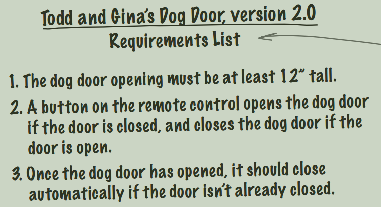
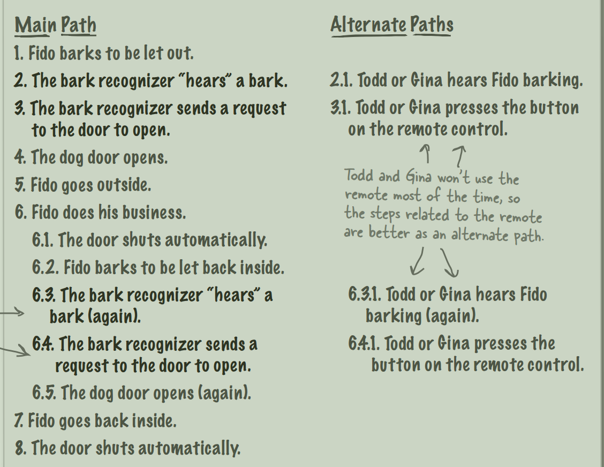

# Doug's Dog Doors

## Problem
   - They want dog door more than normal
   - They want the dog door with a remote control

## Challenges
   - The dog door needs to be closed and they may forget to close the dog door

## Advices
   - You should figure out what the customer really wants
   - Ask the customer for more information (beyond what the customer asked)
   - Go back to requirements after finishing the use-case to make sure it matches it

## notes
   - The requirements is not just what the customer wants, But what the customer wants is good start
     - we should take care of unexpected behaviours may happen in the real world
   - The UseCase is the steps in the system to make the things happen
     - it provides one or more scenarios
     - it interacts with the end user
   - Good UseCase must have
     - Clear value: the goal
     - Start & Stop
     - External Initiator: Someone outside the system start the use-case
   - Main Path (Happy path): this the path which everything goes right, It is usually the customers description
   - The only constant in software is **CHANGE**
   - Alternative Path: is the optional path and provides different paths for the same goal of Main path
----------------------------------------------------------------

## Version 2.0

### Requirement List

### What is the Dog Door do
  1. The Dog barks to be let out
  2. The User hears the Dog barking
  3. The User Press the button on the remote
  4. The Dog Door opens
  5. The Dog go outside
  6. The Dog does his business 
     1. The Dog Door closes automatically
     2. The Dog barks to be let back inside
     3. The user hears the Dog barking
     4. The use Press the button on the remote
     5. The Dog Door opens
  7. The Dog go back inside
  8. The Dog Door closes automatically 

## Version 2.2
### What is the Dog Door do
    - By adding recognizer

